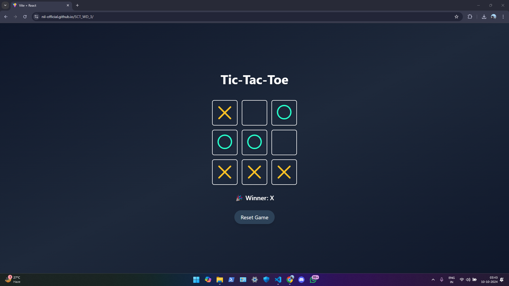

# Tic-Tac-Toe Web Application



## Overview

This **Tic-Tac-Toe Web Application** is a simple, fun, and interactive game built with **React.js** and styled using **Tailwind CSS**. The game allows two players to compete in a classic 3x3 grid, taking turns to place their respective marks, X or O. The app offers a clean interface, intuitive gameplay, and real-time status updates.

## Features

- **Responsive Design**: Optimized for various screen sizes to ensure a smooth experience on desktops, tablets, and mobile devices.
- **Dynamic Game Logic**: The app keeps track of player turns, determines the winner, or detects a draw.
- **Status Messages**: Displays dynamic messages indicating the next player or announcing the winner or draw.
- **Reset Functionality**: A reset button allows players to restart the game at any point.
- **Stylish UI**: A modern interface with attractive background gradients and well-designed icons for X and O.

## Tech Stack

- **Frontend**: React.js
- **Styling**: Tailwind CSS

## Live Demo

Check out the live demo of the application here: [Tic-Tac-Toe Web App](https://nil-official.github.io/SCT_WD_3/)

## Installation

To get started with this project locally, follow these steps:

1. Clone the repository:
   ```bash
   git clone https://github.com/nil-official/SCT_WD_3.git
   cd SCT_WD_3
